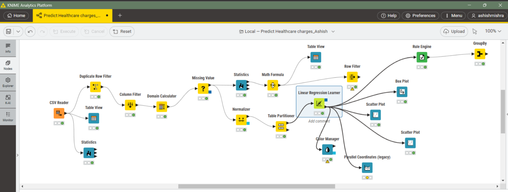

  
  <h2> Medical Insurance Charge Prediction </h2>  
  
 A KNIME-based project for predicting healthcare insurance costs using regression and clustering models 
  

  

---

## 🧩 About KNIME  

[KNIME](https://www.knime.com/) (Konstanz Information Miner) is an **open-source data analytics platform** that allows users to build workflows for data preprocessing, visualization, and machine learning without heavy coding.  

It provides a **drag-and-drop interface** to connect different nodes for tasks like:  
- Data cleaning  
- Exploratory analysis  
- Machine learning modeling  
- Predictive analytics  

---

## 📊 Project Overview  

In this project, I have used **KNIME** to perform **predictive analysis of medical insurance charges**.  

The workflow includes:  
- 📥 Importing and preprocessing healthcare data  
- 🔍 Exploring features such as **age, BMI, smoking status, and region**  
- 🤖 Applying **machine learning models** (regression) to predict insurance charges  
- 📈 Visualizing important relationships between features and charges  

🎯 **Objective:** To **understand the factors influencing medical insurance costs** and build a reliable predictive model.  

---

## 🎯 Objectives  

- Predict insurance charges using regression models  
- Quantify the impact of smoking on medical costs  
- Identify clusters of policyholders with similar risk profiles  
- Investigate the combined effect of **high BMI** and **smoking**  

---

## 🔑 Key Insights  

- 🚬 **Smoking** has the strongest predictive influence on medical costs  
- 📈 **Age** and **BMI** significantly impact charges  
- ⚡ Interaction effects (**BMI × Smoking**) amplify risk  
- 📊 Regression model achieved an **R² of 0.751**  

---

## 📷 Project Screenshot  

 
    
 

---

  
  ✨ *Developed with KNIME by Ashish Mishra* ✨  

  
